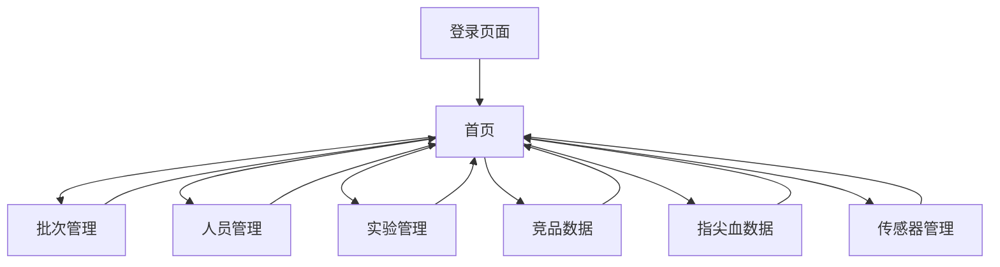

## 1. Product Overview

实验数据管理系统是一个为实验研究提供中心化数据管理的平台，系统地管理实验批次、受试人员、传感器设备、实验过程以及核心数据（指尖血数据和竞品数据）。
- 解决实验数据分散管理、缺乏关联性和可追溯性的问题，为研究人员提供高效的数据录入、查询、更新功能。
- 目标是提高研究效率和数据质量，确保数据的完整性、一致性和可追溯性。

## 2. Core Features

### 2.1 User Roles

| Role | Registration Method | Core Permissions |
|------|---------------------|------------------|
| 管理员 | 默认账号密码登录 | 可访问所有功能模块，进行数据的增删改查操作 |

### 2.2 Feature Module

我们的实验数据管理系统需求包含以下主要页面：
1. **登录页面**：管理员身份验证，系统访问控制。
2. **首页**：系统概览，导航菜单，数据统计展示。
3. **批次管理页面**：批次列表展示，批次信息的增删改查。
4. **人员管理页面**：人员信息管理，个人档案维护。
5. **实验管理页面**：实验记录管理，批次与人员关联。
6. **竞品数据页面**：竞品文件上传下载，数据关联管理。
7. **指尖血数据页面**：血糖数据录入，数据查询和图表展示。

### 2.3 Page Details

| Page Name | Module Name | Feature description |
|-----------|-------------|---------------------|
| 登录页面 | 身份验证 | 管理员账号密码登录，登录状态保持，登录失败提示 |
| 首页 | 导航菜单 | 侧边栏导航，包含批次管理、人员管理、实验管理、数据管理（竞品数据、指尖血数据）、传感器管理菜单项 |
| 首页 | 数据统计 | 显示系统基本统计信息：总批次数、总人员数、总实验数等 |
| 批次管理页面 | 批次列表 | 展示批次号、开始时间、结束时间，支持按批次号搜索和分页 |
| 批次管理页面 | 批次操作 | 新建批次、编辑批次信息、删除批次（含二次确认） |
| 人员管理页面 | 人员列表 | 展示人员姓名、性别、身高、体重、年龄，支持按姓名搜索 |
| 人员管理页面 | 人员操作 | 新建人员、编辑人员信息、删除人员（含二次确认） |
| 实验管理页面 | 实验列表 | 展示实验ID、关联批次号、关联人员姓名、实验内容，支持按批次和人员筛选 |
| 实验管理页面 | 实验操作 | 新建实验记录、编辑实验信息、删除实验记录 |
| 竞品数据页面 | 文件管理 | 文件上传、文件列表展示、文件下载、文件删除，支持按批次和人员筛选 |
| 指尖血数据页面 | 数据管理 | 血糖数据录入、数据列表展示、数据编辑删除，支持按批次、人员、时间范围筛选 |
| 指尖血数据页面 | 数据可视化 | 血糖值变化趋势图表展示，支持筛选条件动态更新 |
| 传感器管理页面 | 传感器列表 | 展示传感器名称、关联人员、关联批次、使用时间，支持筛选 |
| 传感器管理页面 | 传感器操作 | 新建传感器记录、编辑传感器信息、删除传感器记录 |

## 3. Core Process

管理员登录系统后，可以通过侧边栏导航访问各个功能模块。典型的操作流程包括：
1. 创建实验批次 → 添加受试人员 → 创建实验记录关联批次和人员
2. 为特定批次和人员上传竞品文件或录入指尖血数据
3. 管理传感器设备的使用记录
4. 通过各种筛选条件查询和分析实验数据

## 4. User Interface Design

### 4.1 Design Style

- 主色调：#409EFF（Element Plus 默认蓝色），辅助色：#67C23A（成功绿色）、#E6A23C（警告橙色）、#F56C6C（危险红色）
- 按钮样式：圆角按钮，支持不同尺寸和状态
- 字体：系统默认字体，主要文字14px，标题16-18px
- 布局风格：左侧导航 + 右侧内容区域，卡片式组件布局
- 图标风格：Element Plus 内置图标，简洁现代

### 4.2 Page Design Overview

| Page Name | Module Name | UI Elements |
|-----------|-------------|-------------|
| 登录页面 | 登录表单 | 居中卡片布局，包含用户名密码输入框、登录按钮，背景使用渐变色 |
| 首页 | 侧边栏导航 | 深色背景，白色文字，支持折叠展开，菜单项带图标 |
| 首页 | 统计卡片 | 网格布局的统计卡片，显示数字和图标，使用不同颜色区分 |
| 批次管理页面 | 操作区域 | 顶部搜索框和新建按钮，表格下方分页组件 |
| 批次管理页面 | 数据表格 | 斑马纹表格，操作列包含编辑和删除按钮 |
| 人员管理页面 | 表单对话框 | 弹窗形式，包含文本输入框、单选按钮组、数字输入框 |
| 实验管理页面 | 筛选器 | 下拉选择框，支持清空选择 |
| 竞品数据页面 | 文件上传 | 拖拽上传组件，支持文件预览和进度显示 |
| 指尖血数据页面 | 图表区域 | ECharts 折线图，响应式设计，支持数据缩放 |

### 4.3 Responsiveness

系统采用桌面优先设计，主要面向PC端使用。侧边栏导航支持折叠以适应较小屏幕，表格组件支持横向滚动，确保在不同分辨率下的可用性。